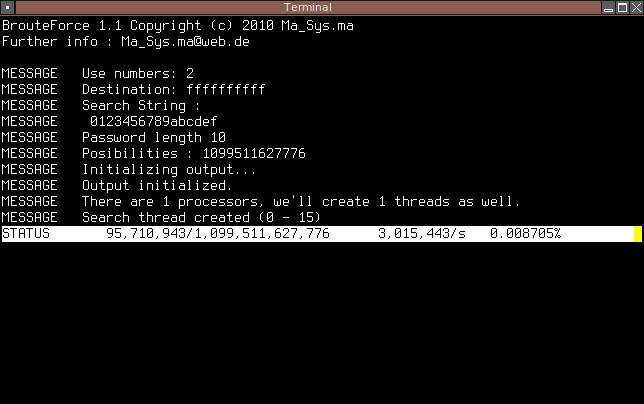

Repository
==========

Dieses Repository enthält alle Versionen der Programme, standardmäßig wird im
JAR file aber nur die neuste Version (3) integriert. Kompilieren erfolgt durch
Eingabe von `ant`.

Beschreibung
============

Der Versionssprung kam dadurch zu Stande, dass der Quelltext von Broute Force
1.1 `BrouteForce2.java` hieß. Deshalb wurde diese Version `BrouteForce3.java`
genannt, weshalb auch in der Versionsangabe „Version 3.0“ steht.

Anstatt einer kompletten Neuentwicklung handelt es sich um eine
Weiterentwicklung des alten Konzeptes, dass man ein Array verwendet, um eine
Kombination abzubilden, die dann erst in eine Zeichenkette konvertiert wird.

Als Neuerung enthält das Programm jetzt eine dedizierte Benchmark-Funktion und
verzichtet auf Optionen wie das Schreiben der Ausgabe in eine Datei. Es
gibt ein Diagramm, welches anders als beim alten ComputerInfo auch unter Windows
funktionieren sollte.

Um die Betriebssystemkompatibilität noch weiter voranzutreiben, gibt es in
dieser Version auch keine weiße Statuszeile mehr, sondern diese wird nicht mehr
vom Hintergrund hervorgehoben.

Außerdem wurde die Suchweise des Programmes geändert: Man kann neuerdings
MD5-Summen „cracken“. Das geht im Test bei bis zu fünf Zeichen relativ schnell.
Andererseits wurde auch das Verteilen auf mehrere Kerne optimiert.
Jeder Thread hat seine eigene Zählvariable, wordurch die Genauigkeit der
Geschwindigkeitsmessung deutlich stieg, weshalb die Vorversionen auch nicht zur
Geschwindigkeitsmessung zu empfehlen sind.

Man muss jetzt keine Passwortlänge mehr angeben, das Programm versucht
einfach alle Passwörter (angefangen von nur ein Zeichen Länge immer weiter)
und bricht erst beim Ergebnis ab. Dadurch wurde auch das System geändert,
nach dem die Threads arbeiteten: Vorher war ein Thread jeweils für einen
Teilbereich zuständig (bei Buchstaben von a bis z waren daher maximal 26 Kerne
auslastbar). Mit dem neuen Programm werden unterschiedliche Passwortlängen auf
die Kerne verteilt. Immer wenn einer der Threads fertig ist, holt er sich
bei der Hauptklasse eine neue Passwortlänge, die er in Angriff nimmt.
Dadurch fängt das Programm bei vier Kernen an, gleichzeitig nach Passwörtern mit
einem, zwei, drei und vier Zeichen zu suchen. Alle diese Threads sind schnell
fertig und der erste (der Passwörter mit nur einem Zeichen gesucht hat) bekommt
die „fünfstelligen“ Passwörter zugewiesen.

Der Nachteil dieser Idee ist natürlich, dass wenn das Programm auf z.B. 32
Kernen rechnet, ein Thread von vorn herein mit dem Suchen von 32-stelligen
Passwörtern beschäftigt ist. Dadurch, dass die wenigsten Nutzer solch lange
Passwörter benutzen, ist dies wohl in den meisten Fällen
Rechenzeitverschwendung. Andererseits ist das Programm aber nicht hauptsächlich
für das Knacken von Passwörtern sondern viel mehr für Benchmarks und Tests
zuständig, weshalb man bspw. bei dieser Version das Alphabet nicht mehr ändern
kann. Der Nutzen, extrem kurze Passwörter (bspw vier oder fünfstellig)
vollständig abzusuchen, kann aber immernoch helfen, um plakativ zu
zeigen, warum man beim Speichern von Passwörtern nicht einfach nur
`MD5(PASSWORT)` rechnet.

## Beispielausgabe

	~$ bruteforce3 --md5 testx
	Broute Force 3.0, Copyright (c) 2012 Ma_Sys.ma.
	For further info send an e-mail to Ma_Sys.ma@web.de.
	
	259aa0dd6cd9465e193e753c6dcf38c4
	
	~$ bruteforce3 --crack 259aa0dd6cd9465e193e753c6dcf38c4
	Broute Force 3.0, Copyright (c) 2012 Ma_Sys.ma.
	For further info send an e-mail to Ma_Sys.ma@web.de.
	
	Trying to crack 259aa0dd6cd9465e193e753c6dcf38c4...
	Using 8 Threads to search.
	Creating and starting threads...
	
	STATUS speed=11646640/s strlen=13
	Combination found:  testx
	Status Display Thread interrupted.
	
	Statistics
		Time:                823484 ms.
		Combinations total:  9433326460
		Avg Combinations/ms: 11455
		Strlen:              20
		Fully searched:      5
		Max Combinations/ms  14165
	
	 _____#________________________________________________________________________
	 _____#________________________________________________________________________
	 ____##___________________#____________________________________________________
	 #######################_############_#_#_#####_###########_######__###########
	 ##############################################################################
	 ##############################################################################
	 ##############################################################################
	 ##############################################################################
	 ##############################################################################
	 ##############################################################################
	 ##############################################################################
	 ##############################################################################
	 ##############################################################################
	 ##############################################################################
	 ##############################################################################
	
	Press enter to exit...
	
	~$

Beschreibung Bruteforce 1
=========================

In der ersten Version konnte ein „Alphabet“ ausgewählt werden (z.B. A-Z,
1-F, ö.Ä.), um anzugeben, welche Zeichen durchprobiert werden sollten.
Außerdem zeigte das Programm unter Linux den Fortschritt in einer weißen Zeile
an.

